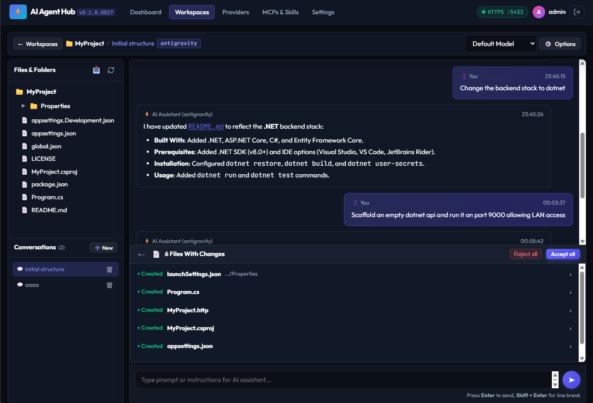
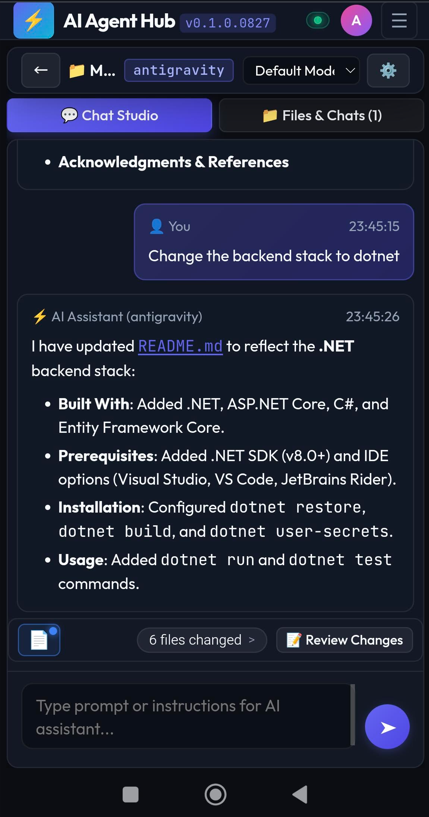

# AI Agent Hub

<p align="left">
  
  
  
  
  
  
</p>

> **A provider-agnostic, self-hosted platform and web interface for orchestrating AI coding assistants.**

AI Agent Hub turns standalone command-line AI coding assistants into a centralized, self-hosted development hub.

While some AI providers offer desktop or web GUIs, they often restrict power-user features, lack advanced CLI tooling, or fail to support the full range of authentication methods available in the terminal. Conversely, raw CLI tools lock you to a single terminal window on a single machine.

AI Agent Hub bridges this gap: it orchestrates official provider CLIs natively under the hood—preserving their full capability, custom tool support, and native authentication flows—while wrapping them in a modern, responsive web interface accessible from any device on your local network.

As an evolving platform, AI Agent Hub is continuously expanding its remote development features to bridge the gap between heavy server-side execution and frictionless client-side interaction.

---

## ✨ Key Features

- 🌐 **Remote CLI Execution & Multi-Device Access** — Host AI agents on your main workstation or home server and interact seamlessly from any browser, laptop, or tablet on your network without installing CLIs or dependencies on client machines.
- 🔑 **Centralized Provider Access & Shared Quota** — Configure provider credentials, authentications, and subscription quotas once on the server, allowing multiple devices across your household or lab to leverage the same AI tools without duplicate setups.
- ⚡ **Full Native CLI Power + Modern GUI** — Leverage the complete capabilities, custom tools, and advanced authentication methods of official CLIs that provider desktop apps often omit, with the convenience of a visual interface.
- 🔌 **Provider-Agnostic Orchestration** — Seamlessly switch between Claude Code, Gemini CLI, OpenAI Codex CLI, OpenCode, and Antigravity CLI (`agy`) using a single consistent workflow.
- 🔍 **Visual Side-by-Side & Unified Diffs** — Review, accept, or reject AI-generated modifications with syntax-highlighted diffs, instant rollback, and pre-execution snapshot tracking.
- 📂 **Workspace & Session Isolation** — Manage multiple projects with independent conversation logs, execution tracking, and custom per-workspace provider/model configurations.
- 🧩 **Native Capabilities & Tool Support** — Preserves provider-specific strengths including MCP (Model Context Protocol) servers, tool use, and custom Skills without reducing them to a lowest common denominator.

---

## 📸 Screenshots

<p align="center">
  <a href="docs/product/desktopview1.png"></a>
  &nbsp;&nbsp;
  <a href="docs/product/mobileview1.png"></a>
</p>

---

## 🔌 Supported Providers

AI Agent Hub integrates natively with the official CLIs of supported providers:

| Provider | CLI Tool | Integration Status | Capabilities |
|---|---|---|---|
| **Antigravity CLI** | `agy` | Supported | Multi-agent orchestration, Skills, Tools |
| **OpenAI Codex CLI** | `codex` | Supported | Code synthesis, Multi-model selection |
| **Gemini CLI** | `gemini` | Supported | Multimodal reasoning, Context caching |
| **Claude Code** | `claude` | Supported | Agentic file editing, Terminal execution |
| **OpenCode** | `opencode` | Supported | Multi-model catalogs, Local & Remote LLMs |

*Additional providers can be integrated via the Provider Adapter pattern without altering the core platform.*

---

## 🚀 Getting Started

### Prerequisites

* [.NET 10 SDK](https://dotnet.microsoft.com/download)
* [Node.js 18+](https://nodejs.org/) & npm (required for frontend asset builds and live development)
* [Git](https://git-scm.com/)
* One or more supported AI provider CLIs installed and on your system `PATH`

---

### Quick Launch (Standard Execution)

The production React frontend is pre-built into `src/AIAgentHub.Web/wwwroot`. To run the full application:

```bash
# 1. Clone the repository
git clone https://github.com/rafaelhbrasil/AIAgentHub.git
cd AIAgentHub

# 2. Run the application
dotnet run --project src/AIAgentHub.Web
```

By default, the server starts on **`https://localhost:5432`** and automatically launches your default browser.

> **Tips:**
> - To start without opening the browser: `dotnet run --project src/AIAgentHub.Web -- --no-browser`
> - To specify custom ports/URLs: `dotnet run --project src/AIAgentHub.Web -- --urls "https://localhost:5001"`

---

### Live Frontend Development (HMR)

If you are developing or modifying the React + TypeScript frontend and want instant Hot Module Reloading (HMR):

1. **Install workspace dependencies (first time only):**
   ```bash
   npm install
   ```

2. **Start the backend server:**
   ```bash
   dotnet run --project src/AIAgentHub.Web
   ```

3. **Start the Vite development server in a separate terminal:**
   ```bash
   npm run dev
   ```

4. Open **`http://localhost:5173`** in your browser. Vite automatically proxies API requests (`/api`) and SignalR hubs (`/hubs`) to the .NET backend at `https://localhost:5432`.

---

## 🛠️ Workspace & Testing Scripts

Common development, testing, and deployment commands can be run directly from the repository root:

| Command | Description |
|---|---|
| `npm run dev` | Start Vite dev server with Hot Module Reloading (HMR) |
| `npm run build` | Compile TypeScript and build production assets into `wwwroot/assets/` |
| `npm test` | Run all fast unit tests (Frontend Vitest + .NET Unit Tests) |
| `npm run test:frontend` | Run frontend unit tests with Vitest |
| `npm run test:unit` | Run backend .NET unit tests (`tests/AgentHub.UnitTests`) |
| `npm run test:integration` | Run backend integration and API tests (`tests/AgentHub.IntegrationTests`) |
| `npm run test:all` | Run the complete test suite (Frontend + Unit + Integration) |
| `npm run deploy` | Publish self-contained executable bundle using `FolderProfile` |
| `npm run deploy:run` | Publish and immediately start the application on `http://localhost:5001` |

---

## 📦 Deployment & Publishing

AI Agent Hub can be published as a self-contained, single-file bundle using the cross-platform deployment script or the .NET CLI.

### Automated Deployment & Release Scripts (Recommended)

```bash
# Publish using FolderProfile (releases any active file locks automatically)
npm run deploy

# Publish and run immediately on https://localhost:5001 (default HTTPS)
npm run deploy:run

# Package a versioned release archive with SHA-256 checksum (e.g. win64 or portable)
npm run release win64 0.1.0
npm run release portable 0.1.0
```

### Manual .NET CLI Publish

```bash
dotnet publish src/AIAgentHub.Web/AIAgentHub.Web.csproj /p:PublishProfile=FolderProfile
```

---

## 📖 Documentation

Comprehensive architecture, product specifications, and development guidelines are available in [`docs/`](docs/):

| Area | Document | Description |
|---|---|---|
| **Architecture** | [Architecture Guide](docs/technical/Architecture.md) | Layered DDD & Clean Architecture, Server-centric execution, and Provider Adapters |
| **Architecture** | [ADR Index](docs/technical/adr/) | Architecture Decision Records (ADR-001 through ADR-011) |
| **Product** | [Product Specification](docs/product/Product.md) | Vision, problem statement, core concepts, and product scope |
| **Product** | [Roadmap](docs/product/Roadmap.md) | Phased product evolution (v0.1 Foundation to Enterprise) |
| **Product** | [Changelog](docs/product/Changelog.md) | Release history, version notes, and migration guidance |
| **Security** | [Security Architecture](docs/technical/SecurityArchitecture.md) | Authentication model, credential encryption, and network security |
| **API** | [API Design](docs/technical/ApiDesign.md) | REST API endpoints and SignalR real-time event schemas |
| **Engineering** | [Development Standards](docs/technical/DevelopmentStandards.md) | Coding conventions, async rules, and engineering best practices |
| **Engineering** | [Repository Structure](docs/technical/RepositoryStructure.md) | Solution layout, directory guidelines, and naming conventions |

---

## 🤝 Contributing

Contributions are welcome! Please check out [CONTRIBUTING.md](CONTRIBUTING.md) for guidelines on development standards, testing, and submitting pull requests.

---

## 📄 License

AI Agent Hub is open-source software licensed under the **[Apache License 2.0](LICENSE)**.

The software is provided "AS IS". Users are responsible for evaluating the security and permissions of AI coding agents running on their systems and complying with the respective third-party provider terms of service.
