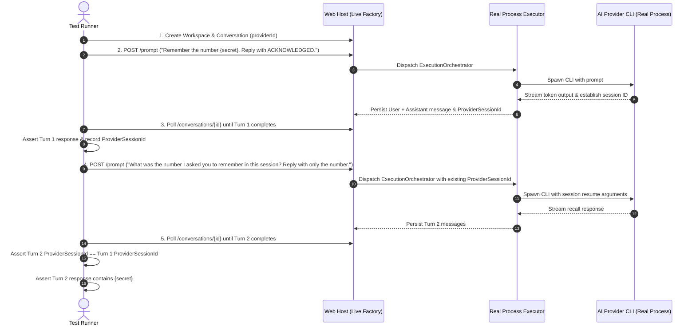

# Specification: Live Provider Chat Integration Tests & Session Consistency

## 1. Overview & Goals
While `ProviderChatIntegrationTests` provides fast, hermetic CI verification using simulated responses (`TestProcessExecutor`), developers need a way to verify real, unmocked AI CLI providers installed on the host machine (`antigravity`, `claude`, `codex`, `gemini`, `opencode`).

This specification defines the architecture, execution rules, dynamic skip logic, and session memory verification flow for **Live Provider Chat Integration Tests**.

---

## 2. Architecture & Components

### 2.1. `LiveProviderWebApplicationFactory`
- **In-Memory Web Application Host**: Bootstraps the full ASP.NET Core pipeline (`Program.cs`).
- **Real Process Execution**: Does **not** replace `IProcessExecutor`—it leaves the production `HeadlessProcessExecutor` registered so real CLI binaries are spawned.
- **Isolated SQLite Storage**: Replaces the database path with a unique temporary SQLite file in `%TEMP%\AgentHubLiveTest_<guid>.db` to guarantee zero interference with the developer's local data.
- **LAN Disabled**: Enforces `NetworkMode = NetworkMode.Localhost` to prevent exposure.

### 2.2. Dynamic Discovery & Skip Mechanics (`Assert.Skip`)
Tests run as a parameterized `[Theory]` across all 5 provider IDs:
```csharp
[Theory]
[InlineData("antigravity")]
[InlineData("claude")]
[InlineData("codex")]
[InlineData("gemini")]
[InlineData("opencode")]
```
Before executing prompts for a provider, the test inspects the provider:
1. **Installed Check**: Queries `provider.IsInstalledAsync()` or `CliProviderBase.FindExecutable(...)`. If not found, calls `Assert.Skip($"Provider '{providerId}' is not installed on this host.")`.
2. **Authentication Check**: Queries `provider.GetStatusAsync()`. If `status == ProviderStatus.Unauthenticated`, calls `Assert.Skip($"Provider '{providerId}' is installed but unauthenticated.")`.
3. **Discontinued Check**: If `status == ProviderStatus.Discontinued` (e.g. legacy Gemini CLI), calls `Assert.Skip($"Provider '{providerId}' is discontinued.")`.

Skipped tests are marked as **Ignored/Skipped** in test runners, not passed or failed.

---

## 3. Two-Turn Session Memory Recall Test Flow

For any installed and authenticated provider:



### 3.1. Turn 1 (Memory Seed)
- Generate a cryptographically random 6-digit number: `var secret = Random.Shared.Next(100000, 999999);`.
- Send prompt: `$"Remember the number {secret}. Reply with only the word 'ACKNOWLEDGED'."`.
- Wait for background execution to finish (with watchdog timeout).
- Assert that an Assistant message is recorded with a non-empty `ProviderSessionId`.

### 3.2. Turn 2 (Memory Recall & Verification)
- Send prompt: `"What was the number I asked you to remember in this session? Reply with only the number."`.
- Wait for background execution to finish (with watchdog timeout).
- Assert that:
  1. Total conversation messages >= 4.
  2. The Turn 2 Assistant `ProviderSessionId` matches Turn 1's `ProviderSessionId` (session continuity).
  3. The Assistant response content contains `secret.ToString()` (conversational memory retention by the real LLM).

---

## 4. Safety & Process Watchdog
- **Timeout per turn**: 60 seconds per turn (120 seconds total per provider test).
- **Execution Watchdog**: If the execution exceeds timeout or hangs, the test calls `provider.AbortAsync(conversationId)` to terminate the process tree immediately and avoid leaking orphan processes.
